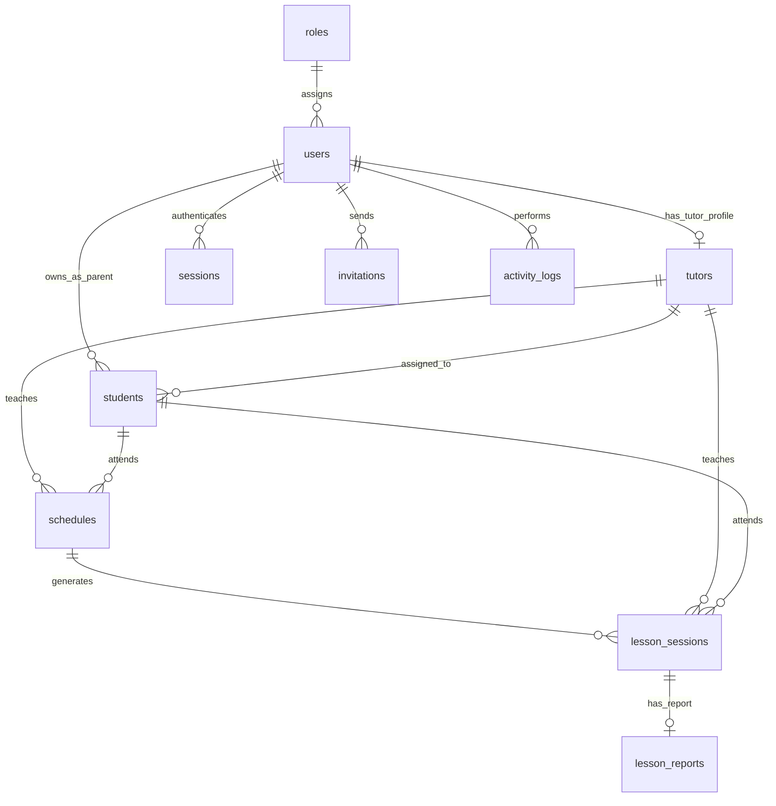

# Tech Spec Kalabelajar

Dokumen ini menjadi tech spec utama untuk membangun Kala Belajar dari project kosong. Fokus dokumen adalah mendefinisikan produk, stack, desain, schema database, role behavior, acceptance criteria, dan test case agar implementasi bisa langsung dikerjakan secara bertahap.

## Product Overview

Kala Belajar adalah platform operasional les privat untuk mengelola hubungan antara Super Admin, Tutor, Parent, dan Murid. MVP berfokus pada pengelolaan user, tutor, murid, assignment tutor, jadwal les, sesi les, dan laporan progres belajar.

### Target User

| Role | Kebutuhan Utama |
| --- | --- |
| Super Admin | Mengelola operasional, data utama, assignment, jadwal, sesi, laporan, dan audit. |
| Tutor | Melihat jadwal dan murid yang ditugaskan, lalu mengisi laporan sesi belajar. |
| Parent | Melihat anak, tutor anak, jadwal les, riwayat sesi, dan progres belajar. |

### Implementation Assumption

Project diasumsikan dimulai dari folder kosong yang hanya berisi tech spec ini, file `.env`, dan repository git yang sudah diinisialisasi serta terhubung ke remote GitHub. Implementasi harus membuat struktur aplikasi, source code, migration, template, asset, test, seed data, changelog, dan summary report dari awal berdasarkan dokumen ini.

### MVP Scope

Masuk MVP:

- Login dan register konservatif menggunakan form email-password.
- Login SSO Google untuk user yang memakai akun Google.
- Auth berbasis server-side session untuk semua metode login.
- Role Super Admin, Tutor, dan Parent.
- Dashboard berbeda untuk setiap role.
- Manajemen user, tutor, parent, dan murid.
- Assignment tutor ke murid.
- Manajemen jadwal les.
- Tutor melihat murid dan jadwal miliknya.
- Tutor mengisi laporan sesi.
- Parent melihat jadwal, tutor anak, riwayat sesi, dan laporan progres.
- Activity log untuk aksi penting.

### Out of Scope

Belum masuk MVP:

- Payment, invoice, dan payroll tutor.
- Chat parent-tutor-admin.
- Native mobile app.
- Broadcast atau pengumuman massal.
- Export data.
- Advanced analytics.
- Multi cabang atau franchise.
- Upload file atau materi belajar.
- Notification email/WhatsApp otomatis.
- Online meeting integration.
- Public tutor marketplace.

## Tech Stack

Kala Belajar menggunakan stack yang sederhana, server-driven, dan cocok untuk aplikasi operasional seperti dashboard les private. Rekomendasi utama adalah mempertahankan Go + PostgreSQL + HTMX + Tailwind karena kebutuhan produk didominasi CRUD, form, list, filter, dashboard, dan role-based access.

### Stack Utama

| Layer | Teknologi | Fungsi | Catatan |
| --- | --- | --- | --- |
| Backend | Go | Bahasa utama backend. | Cocok untuk aplikasi operasional yang butuh performa stabil, binary sederhana, dan deployment ringan. |
| HTTP Framework | Gin | Routing, middleware, handler HTTP. | Gunakan sebagai framework utama untuk server-rendered dashboard. |
| Database | PostgreSQL | Database relasional utama. | Cocok untuk data user, role, tutor, murid, jadwal, sesi, laporan, dan audit log. |
| ORM | GORM | Model, query, relasi, dan migration awal. | Gunakan untuk model dan persistence; siapkan migration yang jelas untuk semua table target. |
| Frontend | HTML Template Go | Server-rendered page. | Cocok untuk dashboard role-based tanpa SPA kompleks. |
| Interactivity | HTMX | Partial update, form submit async, table refresh, toast, modal flow. | Pilihan pas untuk CRUD dashboard karena interaksi tetap ringan dan backend tetap jadi pusat logic. |
| Styling | Tailwind CSS | Utility-first styling. | Cocok untuk membangun dashboard cepat dan konsisten; production sebaiknya pakai build Tailwind, bukan CDN. |
| Auth | Email-password login/register + Google OAuth + server-side session | Login user, register user, SSO Google, dan session management. | Email-password menjadi jalur konservatif; Google OAuth menjadi opsi SSO; local development harus menyediakan default account. |
| Config | `.env` + config loader Go | Konfigurasi environment. | Menyimpan port, database, OAuth, app secret, dan TTL session. |
| Audit | Activity Log table | Mencatat aktivitas penting. | Dipakai Super Admin untuk troubleshooting dan audit operasional. |

### Rekomendasi Arsitektur

- Pertahankan server-rendered HTML sebagai default agar kompleksitas frontend tetap rendah.
- Gunakan HTMX untuk interaksi yang memang butuh update sebagian halaman, seperti filter table, create/update form, toast, dan detail panel.
- Hindari SPA framework seperti React/Vue untuk MVP kecuali nanti ada kebutuhan UI yang sangat kompleks dan state-heavy.
- Pisahkan alur backend sejak awal: handler menerima HTTP request, service menyimpan business logic, repository mengakses database, model mendefinisikan struktur data.
- Untuk production, pertimbangkan migration versioning agar perubahan schema tidak hanya bergantung pada `AutoMigrate`.
- Untuk Tailwind production, pertimbangkan pipeline build agar CSS lebih kecil dan tidak bergantung pada CDN.

### Struktur Aplikasi yang Disarankan

| Area | Lokasi Disarankan | Tanggung Jawab |
| --- | --- | --- |
| Entry point server | `cmd/server/main.go` | Bootstrap config, database, migration, dependency wiring, routing. |
| Seed data local | `cmd/seed/main.go` | Membuat data awal seperti Super Admin local. |
| Config | `internal/config` | Membaca environment variable dan membentuk config aplikasi. |
| Database | `internal/database` | Membuka koneksi PostgreSQL dan menjalankan migration. |
| Models | `internal/models` | Definisi entity GORM dan relasi database. |
| Repositories | `internal/repositories` | Query database dan persistence. |
| Services | `internal/services` | Business logic per domain. |
| Middleware | `internal/middleware` | Auth, RBAC, logging, recovery-related behavior. |
| Handlers | `internal/handlers` | HTTP handler untuk halaman dan action dashboard. |
| Templates | `web/templates` | Layout, page, dan partial HTML. |
| Static assets | `web/static` | CSS, JavaScript, dan image aplikasi. |

### Pendapat Produk-Teknis

Untuk fase Kala Belajar sekarang, stack ini sudah sangat masuk akal. Produk ini lebih butuh alur operasional yang jelas, data rapi, dan dashboard yang cepat dibuat daripada frontend yang terlalu berat; jadi Go, PostgreSQL, server-rendered template, HTMX, dan Tailwind adalah kombinasi yang efisien.

## Design

Desain Kala Belajar harus mengikuti brand identity yang didefinisikan di section ini: ceria, ramah, suportif, dan optimis, tetapi tetap kredibel untuk orang tua serta cukup rapi untuk kebutuhan operasional admin. Produk ini bukan landing page marketing, melainkan aplikasi dashboard yang dipakai berulang, sehingga visual brand perlu hadir lewat warna, tipografi, tone, status, empty state, dan detail kecil tanpa mengorbankan keterbacaan data.

### Design Direction

- Kepribadian utama: friendly, supportive, patient, motivating, clear, growth-focused.
- Level playful: balanced, yaitu ceria dan hangat, tetapi tetap profesional.
- Bahasa UI: Bahasa Indonesia santai, pendek, jelas, dan membantu.
- Super Admin dirancang desktop/laptop-first karena mayoritas dipakai untuk operasional, table, filter, dan detail data.
- Tutor dan Parent dirancang mobile-first karena mayoritas akses dilakukan lewat HP; Tutor terutama perlu mengisi laporan sesi dari mobile web.
- Semua role tetap harus responsive di desktop dan mobile.

### Brand Personality

| Aspek | Arahan |
| --- | --- |
| Rasa utama | Belajar terasa didampingi, memotivasi, dan membuat percaya diri. |
| Untuk siswa | Ceria, ringan, tidak mengintimidasi. |
| Untuk parent | Terpercaya, jelas, memberi rasa aman. |
| Untuk tutor | Praktis, fokus, membantu kerja harian. |
| Untuk admin | Rapi, efisien, mudah discan. |
| Hindari | Terlalu formal seperti institusi kaku, terlalu childish, atau terlalu dekoratif untuk dashboard operasional. |

### Color System

Warna utama mengikuti brand identity. Teal dan deep blue menjadi jangkar visual; warna lain dipakai sebagai aksen, status, dan highlight seperlunya.

| Token | Hex | Fungsi UI | Catatan |
| --- | --- | --- | --- |
| Primary Teal | `#00BDA8` | Primary CTA, active state, success, highlight positif. | Gunakan untuk tombol utama seperti Simpan, Tambah, Isi Laporan. |
| Teal Dark | `#009D90` | Hover primary, teks aksen, state aktif yang butuh kontras. | Cocok untuk link aktif atau label kecil. |
| Deep Blue | `#003182` | Sidebar admin, heading, navigasi utama, primary dark surface. | Memberi kesan trust dan struktur. |
| Sun Yellow | `#F8B700` | Pending, waiting, achievement, highlight ringan. | Pastikan teks di atas warna ini memakai warna gelap. |
| Warm Orange | `#F78A0A` | Secondary accent, motivasi, warning ringan. | Jangan terlalu dominan di dashboard. |
| Coral Red | `#FF3B4F` | Error, destructive action, urgent attention. | Gunakan hemat untuk aksi berisiko atau status bermasalah. |
| Creative Purple | `#704CAD` | Special/admin indicator, creative accent. | Bisa dipakai untuk badge role atau insight khusus. |
| Sky Blue | `#008EDE` | Info state, link sekunder, highlight progres. | Cocok untuk status informatif. |
| Ink | `#12203C` | Teks utama. | Default body text. |
| Muted | `#5A6680` | Teks sekunder, helper text, metadata. | Cocok untuk timestamp, deskripsi, hint form. |
| Line | `#DCE4F1` | Border, divider, table line. | Border harus soft dan tidak terlalu kontras. |
| Soft | `#F4F8FB` | Background halaman dashboard. | Membantu card putih terlihat clean. |
| White | `#FFFFFF` | Card, modal, panel, surface utama. | Default surface untuk konten. |

### Color Usage Rules

- Gunakan Deep Blue untuk struktur utama seperti sidebar Super Admin, heading penting, dan navigasi.
- Gunakan Primary Teal untuk aksi utama dan status positif.
- Gunakan Sun Yellow untuk pending/waiting, bukan error.
- Gunakan Coral Red hanya untuk error, batal, destructive, atau perhatian penting.
- Gunakan warna aksen maksimal sebagai penanda, bukan sebagai background besar berulang.
- Dashboard tidak boleh terasa satu warna; tetap gunakan white/soft background dengan aksen brand secukupnya.
- Semua teks di atas warna harus memenuhi kontras yang nyaman dibaca.

### Typography

| Elemen | Font | Weight | Catatan |
| --- | --- | --- | --- |
| Heading halaman | Poppins | 700-800 | Dipakai untuk judul dashboard dan section utama. |
| Heading card | Poppins | 600-700 | Ukuran lebih kecil, jangan hero-scale di dashboard. |
| Button | Poppins | 700-800 | Singkat dan action-oriented. |
| Body text | Nunito Sans | 400-700 | Default untuk paragraf, tabel, form, dan metadata. |
| Label kecil | Poppins atau Nunito Sans | 700-800 | Poppins untuk emphasis, Nunito untuk UI padat. |

Aturan tipografi:

- Letter spacing gunakan `0`, tidak perlu negatif.
- Jangan pakai ukuran font yang terlalu besar di dashboard padat.
- Heading dashboard harus jelas, tetapi konten table dan form tetap jadi fokus.
- Body copy menggunakan Bahasa Indonesia santai dan mudah dimengerti.

### Logo Usage

- Logo full-color dipakai di login page, sidebar/header dashboard, dan halaman brand-facing.
- Logo sebaiknya muncul sekali sebagai identitas utama di dashboard, bukan diulang di setiap card.
- Gunakan logo di background putih atau sangat terang.
- Jangan stretch, compress, rotate, recolor random, atau menambahkan heavy shadow/outline pada logo.
- Untuk mobile, logo boleh diperkecil di top bar agar ruang konten tetap lega.

### Shape, Radius, Shadow, and Spacing

- Card, modal, input, dan panel menggunakan border radius `8px`.
- Icon button atau avatar boleh full rounded jika fungsinya memang circular.
- Hindari card di dalam card; gunakan section, divider, atau table row untuk struktur.
- Gunakan border `#DCE4F1` dan shadow lembut seperti `0 12px 36px rgba(0, 49, 130, 0.07)`.
- Background halaman dashboard menggunakan `#F4F8FB`, sedangkan konten utama memakai surface putih.
- Spacing dashboard harus rapat tapi bernapas: cukup untuk scan cepat, tidak seperti landing page yang terlalu longgar.

### Icon and Illustration Style

- Ikon menggunakan gaya rounded, stroke sedang, dan konsisten.
- Untuk implementasi frontend, gunakan library icon yang konsisten jika tersedia; jika tidak, gunakan SVG inline dengan gaya seragam.
- Ilustrasi atau motif dipakai terutama untuk empty state, onboarding, atau banner ringan.
- Motif brand yang boleh dipakai: arc/lengkung logo, halaman buku, titik, bintang/spark, dan bentuk membulat.
- Jangan memenuhi dashboard operasional dengan dekorasi besar yang mengganggu table dan form.

### Copywriting Tone

Bahasa UI menggunakan Indonesia santai yang jelas dan reassuring.

| Konteks | Contoh Copy |
| --- | --- |
| Success | `Data berhasil disimpan.` |
| Empty jadwal | `Belum ada jadwal hari ini.` |
| Empty laporan | `Laporan belum tersedia.` |
| CTA Tutor | `Isi Laporan` |
| CTA Parent | `Cek Progres Anak` |
| CTA Admin | `Tambah Jadwal`, `Assign Tutor`, `Verifikasi Tutor` |
| Error ringan | `Ada data yang belum lengkap.` |
| Loading | `Memuat data...` |

Aturan copy:

- Gunakan kalimat pendek.
- Hindari istilah teknis jika tidak perlu.
- Untuk parent, copy harus menenangkan dan informatif.
- Untuk tutor, copy harus langsung ke pekerjaan yang perlu dilakukan.
- Untuk admin, copy harus presisi dan mendukung keputusan operasional.

### Responsive Strategy

| Role | Primary Device | Arahan Layout |
| --- | --- | --- |
| Super Admin | Desktop/laptop-first | Sidebar kiri permanen, top content header, table padat, filter jelas, detail page/drawer. |
| Tutor | Mobile-first | Home ringkas, jadwal hari ini, CTA Isi Laporan terlihat jelas, form laporan nyaman di HP. |
| Parent | Mobile-first | Fokus pada anak, jadwal terdekat, tutor anak, dan laporan progres terbaru. |

Aturan responsive:

- Desktop Super Admin menggunakan sidebar kiri dan area konten lebar.
- Mobile semua role menggunakan top bar compact dan drawer/menu mobile.
- Tutor dan Parent boleh memakai bottom navigation jika nanti dibutuhkan untuk akses cepat, tetapi MVP cukup dengan mobile drawer/top nav jika ingin lebih sederhana.
- Table besar di mobile harus berubah menjadi card list atau row yang bisa discroll secara horizontal hanya jika benar-benar perlu.
- Form laporan tutor harus nyaman di layar kecil: label jelas, textarea cukup tinggi, CTA sticky di bawah jika form panjang.

### Layout Patterns

#### Dashboard Page Pattern

- Bagian atas berisi sapaan, konteks role, dan ringkasan paling penting.
- Super Admin dashboard menampilkan metric cards, aktivitas terbaru, pending item, dan shortcut operasional.
- Tutor dashboard menampilkan jadwal terdekat, murid aktif, laporan yang belum diisi, dan CTA `Isi Laporan`.
- Parent dashboard menampilkan anak, jadwal les terdekat, tutor aktif, dan update progres terakhir.
- Hindari hero besar di dashboard; dashboard adalah tool kerja, bukan landing page.

#### List / Table Page Pattern

- Dipakai untuk Super Admin: user, tutor, murid, jadwal, laporan, dan activity log.
- Header halaman berisi title, deskripsi singkat, primary action, search, dan filter.
- Table desktop harus mudah discan: kolom penting di kiri, status/action di kanan.
- Status memakai badge warna konsisten.
- Mobile list berubah menjadi card row dengan informasi utama dan action ringkas.

#### Detail Page Pattern

- Dipakai untuk detail tutor, parent, murid, jadwal, dan laporan sesi.
- Header detail berisi nama entity, status, dan action utama.
- Konten dibagi menjadi section: informasi dasar, relasi, jadwal, riwayat, dan catatan.
- Untuk Super Admin desktop, detail dapat berupa halaman penuh atau side drawer jika konteks list perlu tetap terlihat.
- Untuk Tutor/Parent mobile, detail sebaiknya halaman penuh agar fokus dan mudah dibaca.

#### Form / Modal Pattern

- Form pendek boleh modal.
- Form panjang, seperti laporan sesi tutor, harus halaman penuh terutama di mobile.
- Field wajib diberi label jelas dan validasi inline.
- Primary action selalu jelas: `Simpan`, `Kirim Laporan`, `Assign Tutor`.
- Destructive action harus diberi warna Coral Red dan konfirmasi.

#### Report Page Pattern

- Report adalah pattern penting untuk Tutor, Parent, dan Super Admin.
- Tutor melihat form input laporan sesi.
- Parent melihat laporan progres anak dalam format read-only yang nyaman dibaca.
- Super Admin melihat laporan sebagai data operasional dan audit.
- Isi laporan minimal mencakup status sesi, materi, progres, PR/tugas, kendala, dan saran latihan.

#### Empty, Loading, and Error State Pattern

- Empty state harus ramah dan memberi next step.
- Loading state cukup sederhana dan tidak perlu animasi berat.
- Error state harus menjelaskan masalah dan langkah lanjut.
- Empty state boleh memakai motif kecil seperti bintang, arc, atau ilustrasi belajar ringan.

### Role-Based Design Notes

#### Super Admin

- UI harus padat, rapi, dan cepat discan.
- Prioritaskan table, filter, badge status, dan action yang jelas.
- Sidebar kiri desktop menjadi navigasi utama.
- Metric card boleh memakai aksen warna brand, tetapi konten utama tetap netral.
- Super Admin membutuhkan confidence dan kontrol, bukan desain yang terlalu playful.

#### Tutor

- UI harus mobile-first dan task-first.
- Jadwal hari ini dan CTA `Isi Laporan` harus mudah ditemukan.
- Form laporan harus nyaman diketik di HP.
- Informasi murid harus ringkas tapi cukup untuk persiapan mengajar.
- Riwayat mengajar harus membantu tutor mengingat progres murid sebelumnya.

#### Parent

- UI harus mobile-first, tenang, dan reassuring.
- Fokus pada anak, jadwal terdekat, tutor anak, dan laporan progres.
- Copy harus membuat parent merasa tahu apa yang terjadi tanpa membebani.
- Laporan progres harus mudah dibaca, tidak terlihat seperti data mentah.
- Jika laporan belum ada, tampilkan status yang jelas dan ramah.

## Schema / Database

Database menggunakan PostgreSQL. Implementasi harus menyediakan model dan migration untuk seluruh table target di bawah agar fitur auth, role, jadwal, sesi les, laporan tutor, progress parent, dan audit log bisa berjalan rapi.

### Prinsip Schema

- Primary key untuk entity utama menggunakan UUID dengan default `gen_random_uuid()`, kecuali `roles` yang memakai ID numerik tetap.
- Table `sessions` adalah session autentikasi, bukan sesi les. Untuk sesi belajar aktual, gunakan table `lesson_sessions`.
- Auth mendukung dua jalur: email-password lokal dan Google OAuth. User lokal menyimpan `password_hash`; user OAuth menyimpan provider data dan boleh tidak memiliki password.
- Data audit menggunakan `activity_logs` dengan pola polymorphic reference lewat `entity_type` dan `entity_id`.
- Data yang masih perlu fleksibel, seperti subject tutor dan metadata audit, menggunakan `jsonb`.
- Soft delete direkomendasikan untuk `users` lewat `deleted_at`; entity operasional lain memakai status aktif/nonaktif agar riwayat tetap utuh.

### Entity Relationship Diagram



### Table Inventory

| Table | Fungsi | Relasi Utama |
| --- | --- | --- |
| `roles` | Master role aplikasi: Super Admin, Tutor, Parent. | `roles.id` ke `users.role_id`. |
| `users` | Akun login utama untuk semua role. | Punya role, tutor profile, session auth, murid sebagai parent, activity log. |
| `tutors` | Profil tambahan untuk user dengan role Tutor. | One-to-one ke `users`, one-to-many ke `students`, `schedules`, dan `lesson_sessions`. |
| `students` | Data anak/murid milik parent. | Many-to-one ke parent `users`, optional many-to-one ke `tutors`. |
| `schedules` | Jadwal les berulang atau jadwal aktif antara tutor dan murid. | Many-to-one ke `tutors` dan `students`. |
| `sessions` | Session autentikasi server-side. | Many-to-one ke `users`. |
| `invitations` | Link undangan onboarding user. | Many-to-one ke inviter `users`. |
| `activity_logs` | Audit trail aktivitas penting. | Many-to-one ke `users`, optional polymorphic entity reference. |
| `lesson_sessions` | Sesi les aktual per pertemuan. | Many-to-one ke `schedules`, `tutors`, dan `students`. |
| `lesson_reports` | Laporan tutor setelah sesi les. | One-to-one ke `lesson_sessions`; dibaca Tutor, Parent, dan Super Admin. |

### Detail Table

#### `roles`

Table master untuk role aplikasi. Data default disiapkan oleh seed role: `superadmin`, `tutor`, dan `parent`.

| Column | Type | Constraint | Catatan |
| --- | --- | --- | --- |
| `id` | integer | primary key | ID tetap: 1 Super Admin, 2 Tutor, 3 Parent. |
| `name` | varchar(50) | unique, not null | Value sistem seperti `superadmin`, `tutor`, `parent`. |
| `display_name` | varchar(100) | not null | Label role untuk UI. |
| `created_at` | timestamptz | not null | Waktu role dibuat. |

#### `users`

Table akun utama untuk semua user. Role ditentukan lewat `role_id`; user tanpa role dianggap pending.

| Column | Type | Constraint | Catatan |
| --- | --- | --- | --- |
| `id` | uuid | primary key, default `gen_random_uuid()` | ID user. |
| `email` | varchar(255) | unique, not null | Identitas login utama. |
| `name` | varchar(255) | not null | Nama user. |
| `avatar_url` | varchar(512) | nullable | Avatar dari provider OAuth. |
| `provider` | varchar(50) | default `google` | Provider login. |
| `provider_id` | varchar(255) | nullable | ID user dari provider. |
| `password_hash` | text | nullable | Hash password untuk login/register form konservatif; null untuk user OAuth-only. |
| `role_id` | integer | nullable, indexed, FK ke `roles.id` | Null berarti user pending role. |
| `is_active` | boolean | default `true` | Status aktif akun. |
| `last_login_at` | timestamptz | nullable | Waktu login terakhir. |
| `created_at` | timestamptz | not null | Waktu akun dibuat. |
| `updated_at` | timestamptz | not null | Waktu akun terakhir diperbarui. |
| `deleted_at` | timestamptz | nullable, indexed | Soft delete GORM. |

Relasi:

- `roles.id` one-to-many `users.role_id`.
- `users.id` one-to-one `tutors.user_id`.
- `users.id` one-to-many `students.parent_id`.
- `users.id` one-to-many `sessions.user_id`.
- `users.id` one-to-many `invitations.invited_by`.
- `users.id` one-to-many `activity_logs.user_id`.

#### `tutors`

Table profil tutor yang melengkapi data user. Hanya user dengan role Tutor yang seharusnya memiliki row di table ini.

| Column | Type | Constraint | Catatan |
| --- | --- | --- | --- |
| `id` | uuid | primary key, default `gen_random_uuid()` | ID tutor profile. |
| `user_id` | uuid | unique, not null, FK ke `users.id` | Satu user hanya punya satu tutor profile. |
| `phone` | varchar(20) | nullable | Nomor HP tutor. |
| `subjects` | jsonb | default `[]` | Daftar subject yang diajar. |
| `bio` | text | nullable | Bio singkat tutor. |
| `is_verified` | boolean | default `false` | Status approval tutor. |
| `created_at` | timestamptz | not null | Waktu profil dibuat. |
| `updated_at` | timestamptz | not null | Waktu profil terakhir diperbarui. |

Relasi:

- `tutors.user_id` one-to-one `users.id`.
- `tutors.id` one-to-many `students.assigned_tutor_id`.
- `tutors.id` one-to-many `schedules.tutor_id`.
- `tutors.id` one-to-many `lesson_sessions.tutor_id`.

#### `students`

Table data anak/murid. Setiap murid dimiliki oleh satu parent dan dapat ditugaskan ke satu tutor.

| Column | Type | Constraint | Catatan |
| --- | --- | --- | --- |
| `id` | uuid | primary key, default `gen_random_uuid()` | ID murid. |
| `parent_id` | uuid | not null, indexed, FK ke `users.id` | Parent pemilik data anak. |
| `name` | varchar(255) | not null | Nama murid. |
| `grade` | varchar(50) | nullable | Kelas murid. |
| `school` | varchar(255) | nullable | Sekolah murid. |
| `assigned_tutor_id` | uuid | nullable, indexed, FK ke `tutors.id` | Tutor aktif yang ditugaskan. |
| `created_at` | timestamptz | not null | Waktu data dibuat. |
| `updated_at` | timestamptz | not null | Waktu data terakhir diperbarui. |

Relasi:

- `students.parent_id` many-to-one `users.id`.
- `students.assigned_tutor_id` optional many-to-one `tutors.id`.
- `students.id` one-to-many `schedules.student_id`.
- `students.id` one-to-many `lesson_sessions.student_id`.

#### `schedules`

Table jadwal les aktif antara tutor dan murid. Model awal merepresentasikan jadwal berbasis hari dalam minggu dan rentang jam.

| Column | Type | Constraint | Catatan |
| --- | --- | --- | --- |
| `id` | uuid | primary key, default `gen_random_uuid()` | ID jadwal. |
| `tutor_id` | uuid | not null, indexed, FK ke `tutors.id` | Tutor pengajar. |
| `student_id` | uuid | not null, indexed, FK ke `students.id` | Murid yang mengikuti jadwal. |
| `subject` | varchar(100) | nullable | Subject jadwal. |
| `day_of_week` | integer | not null | 0 Minggu, 1 Senin, sampai 6 Sabtu. |
| `start_time` | varchar(5) | not null | Format `HH:MM`. |
| `end_time` | varchar(5) | not null | Format `HH:MM`. |
| `location` | varchar(255) | nullable | Lokasi les. |
| `is_active` | boolean | default `true` | Status aktif jadwal. |
| `created_at` | timestamptz | not null | Waktu jadwal dibuat. |
| `updated_at` | timestamptz | not null | Waktu jadwal terakhir diperbarui. |

Relasi:

- `schedules.tutor_id` many-to-one `tutors.id`.
- `schedules.student_id` many-to-one `students.id`.
- `schedules.id` one-to-many `lesson_sessions.schedule_id` untuk pertemuan aktual.

#### `sessions`

Table session autentikasi server-side. Nama table ini tidak boleh dipakai untuk sesi les agar tidak rancu dengan auth.

| Column | Type | Constraint | Catatan |
| --- | --- | --- | --- |
| `id` | uuid | primary key, default `gen_random_uuid()` | ID session auth. |
| `user_id` | uuid | not null, indexed, FK ke `users.id` | Pemilik session. |
| `token` | varchar(512) | unique, not null | Token session. |
| `refresh_token` | text | nullable | Refresh token provider, tidak diekspos ke JSON. |
| `expires_at` | timestamptz | not null | Waktu session expired. |
| `ip_address` | varchar(45) | nullable | IPv4 atau IPv6. |
| `user_agent` | text | nullable | User agent browser. |
| `created_at` | timestamptz | not null | Waktu session dibuat. |

#### `invitations`

Table link undangan onboarding user. Table ini disiapkan sebagai fondasi onboarding terkontrol, meskipun fitur invite bukan prioritas utama MVP role terbaru.

| Column | Type | Constraint | Catatan |
| --- | --- | --- | --- |
| `id` | uuid | primary key, default `gen_random_uuid()` | ID invitation. |
| `email` | varchar(255) | not null | Email penerima invite. |
| `role_name` | varchar(50) | not null | Role yang akan diberikan saat invite dipakai. |
| `invited_by` | uuid | not null, FK ke `users.id` | User admin pembuat invite. |
| `token` | varchar(255) | unique, not null | Token invite. |
| `is_used` | boolean | default `false` | Status pemakaian invite. |
| `expires_at` | timestamptz | not null | Waktu expired invite. |
| `created_at` | timestamptz | not null | Waktu invite dibuat. |

#### `activity_logs`

Table audit trail untuk aktivitas penting user. Cocok untuk Super Admin menelusuri perubahan role, approval tutor, assignment, dan aktivitas login/logout.

| Column | Type | Constraint | Catatan |
| --- | --- | --- | --- |
| `id` | uuid | primary key, default `gen_random_uuid()` | ID activity log. |
| `user_id` | uuid | not null, indexed, FK ke `users.id` | User pelaku aktivitas. |
| `action` | varchar(100) | not null | Contoh: `login`, `assign_role`, `verify_tutor`. |
| `entity_type` | varchar(50) | nullable | Jenis entity yang terdampak, misalnya `student` atau `tutor`. |
| `entity_id` | uuid | nullable | ID entity terdampak; tidak selalu enforce FK. |
| `metadata` | jsonb | default `{}` | Detail tambahan perubahan. |
| `ip_address` | varchar(45) | nullable | IP pelaku aktivitas. |
| `created_at` | timestamptz | not null, indexed | Waktu aktivitas terjadi. |

#### `lesson_sessions`

Table sesi les aktual per pertemuan. Table ini dibutuhkan untuk membedakan jadwal berulang (`schedules`) dari kejadian les yang benar-benar terjadi.

| Column | Type | Constraint | Catatan |
| --- | --- | --- | --- |
| `id` | uuid | primary key, default `gen_random_uuid()` | ID sesi les aktual. |
| `schedule_id` | uuid | nullable, indexed, FK ke `schedules.id` | Jadwal asal; nullable untuk sesi ad-hoc. |
| `tutor_id` | uuid | not null, indexed, FK ke `tutors.id` | Tutor pengajar. |
| `student_id` | uuid | not null, indexed, FK ke `students.id` | Murid peserta sesi. |
| `subject` | varchar(100) | nullable | Subject sesi. |
| `scheduled_start_at` | timestamptz | not null | Waktu mulai yang dijadwalkan. |
| `scheduled_end_at` | timestamptz | not null | Waktu selesai yang dijadwalkan. |
| `actual_start_at` | timestamptz | nullable | Waktu mulai aktual. |
| `actual_end_at` | timestamptz | nullable | Waktu selesai aktual. |
| `status` | varchar(30) | not null, default `scheduled` | `scheduled`, `completed`, `canceled`, `student_absent`, `follow_up_required`, `rescheduled`. |
| `location` | varchar(255) | nullable | Lokasi sesi. |
| `created_at` | timestamptz | not null | Waktu sesi dibuat. |
| `updated_at` | timestamptz | not null | Waktu sesi terakhir diperbarui. |

Relasi:

- `lesson_sessions.schedule_id` optional many-to-one `schedules.id`.
- `lesson_sessions.tutor_id` many-to-one `tutors.id`.
- `lesson_sessions.student_id` many-to-one `students.id`.
- `lesson_sessions.id` one-to-one `lesson_reports.lesson_session_id`.

#### `lesson_reports`

Table laporan tutor setelah sesi les. Data ini menjadi sumber untuk Laporan Progres Anak, Riwayat Mengajar, dan Laporan Sesi / Kehadiran Super Admin.

| Column | Type | Constraint | Catatan |
| --- | --- | --- | --- |
| `id` | uuid | primary key, default `gen_random_uuid()` | ID laporan sesi. |
| `lesson_session_id` | uuid | unique, not null, FK ke `lesson_sessions.id` | Satu sesi maksimal satu laporan final. |
| `tutor_id` | uuid | not null, indexed, FK ke `tutors.id` | Tutor pembuat laporan. |
| `student_id` | uuid | not null, indexed, FK ke `students.id` | Murid yang dilaporkan. |
| `material_summary` | text | not null | Materi yang dibahas. |
| `progress_summary` | text | nullable | Ringkasan progres anak. |
| `homework` | text | nullable | PR atau tugas untuk anak. |
| `issue_notes` | text | nullable | Catatan kendala selama sesi. |
| `home_practice_suggestion` | text | nullable | Saran latihan di rumah. |
| `published_at` | timestamptz | nullable | Null berarti draft/belum tampil ke parent. |
| `created_at` | timestamptz | not null | Waktu laporan dibuat. |
| `updated_at` | timestamptz | not null | Waktu laporan terakhir diperbarui. |

Relasi:

- `lesson_reports.lesson_session_id` one-to-one `lesson_sessions.id`.
- `lesson_reports.tutor_id` many-to-one `tutors.id`.
- `lesson_reports.student_id` many-to-one `students.id`.

### Index dan Constraint Penting

- `users.email` harus unique untuk mencegah akun duplikat.
- `users.role_id`, `students.parent_id`, `students.assigned_tutor_id`, `schedules.tutor_id`, `schedules.student_id`, `sessions.user_id`, dan `activity_logs.user_id` perlu index untuk query dashboard dan daftar operasional.
- `tutors.user_id` harus unique agar satu user tidak punya lebih dari satu profil tutor.
- `sessions.token` dan `invitations.token` harus unique karena dipakai sebagai credential/token lookup.
- `lesson_reports.lesson_session_id` harus unique agar satu sesi tidak punya lebih dari satu laporan final.
- `lesson_sessions` perlu index gabungan yang direkomendasikan: `(tutor_id, scheduled_start_at)`, `(student_id, scheduled_start_at)`, dan `(status, scheduled_start_at)` untuk dashboard Tutor, Parent, dan Super Admin.

## Roles

### Super Admin

Super Admin adalah role operasional utama untuk mengelola platform Kala Belajar di fase awal. Role ini berfungsi sebagai pusat kontrol untuk user, tutor, murid, jadwal, laporan sesi, dan monitoring aktivitas.

#### Catatan Akses Local

- Email default local: `admin@kalabelajar.com`
- Password default local: `admin123`
- Kredensial ini hanya berlaku untuk environment local/development.

#### AC 0.1 - Akses Local Super Admin

- Kondisi aplikasi berjalan di environment local/development.
- Ketika user login menggunakan email `admin@kalabelajar.com` dan password `admin123`.
- Maka user berhasil masuk sebagai Super Admin dan dapat mengakses menu operasional Super Admin.

#### AC 1.1 - Fitur Dashboard Ringkasan

- Kondisi Super Admin membuka halaman Dashboard Ringkasan.
- Ketika halaman dashboard berhasil dimuat.
- Maka Super Admin dapat melihat snapshot utama: total tutor, total murid, total parent, jadwal aktif, pending approval, dan aktivitas terbaru.

#### AC 1.2 - Detail Metrik Dashboard Ringkasan

- Kondisi Super Admin berada di halaman Dashboard Ringkasan.
- Ketika Super Admin hover atau klik salah satu metrik seperti total tutor, total murid, atau jadwal aktif.
- Maka sistem menampilkan ringkasan detail yang relevan, misalnya daftar data terbaru, status aktif/nonaktif, atau link menuju halaman manajemen terkait.

#### AC 2.1 - Fitur Manajemen User

- Kondisi Super Admin membuka halaman Manajemen User.
- Ketika halaman daftar user berhasil dimuat.
- Maka Super Admin dapat melihat daftar akun parent, tutor, dan admin lain beserta nama, email, role, status aktif, dan tanggal dibuat.

#### AC 2.2 - Aksi pada Manajemen User

- Kondisi Super Admin berada di halaman Manajemen User.
- Ketika Super Admin memilih salah satu user.
- Maka Super Admin dapat mengecek detail akun, mengubah role, serta mengaktifkan atau menonaktifkan akun sesuai kebutuhan operasional.

#### AC 3.1 - Fitur Approval Tutor

- Kondisi Super Admin membuka daftar tutor yang membutuhkan approval.
- Ketika ada tutor baru atau tutor yang belum diverifikasi.
- Maka Super Admin dapat melihat data profil tutor, kontak, subject, bio, dan status kelayakan untuk ditinjau.

#### AC 3.2 - Keputusan Approval Tutor

- Kondisi Super Admin sedang meninjau profil tutor yang belum diverifikasi.
- Ketika Super Admin menyetujui atau menolak approval tutor.
- Maka sistem memperbarui status verifikasi tutor dan mencatat aktivitas tersebut ke Activity Log.

#### AC 4.1 - Fitur Manajemen Tutor

- Kondisi Super Admin membuka halaman Manajemen Tutor.
- Ketika halaman daftar tutor berhasil dimuat.
- Maka Super Admin dapat melihat daftar tutor beserta subject, status aktif, status verifikasi, jumlah murid, dan jadwal aktif.

#### AC 4.2 - Kontrol Operasional Tutor

- Kondisi Super Admin berada di halaman Manajemen Tutor.
- Ketika Super Admin memilih satu tutor dari daftar.
- Maka Super Admin dapat membuka detail tutor untuk mengecek profil, murid yang ditangani, jadwal mengajar, dan kebutuhan tindak lanjut.

#### AC 5.1 - Fitur Manajemen Murid

- Kondisi Super Admin membuka halaman Manajemen Murid.
- Ketika halaman daftar murid berhasil dimuat.
- Maka Super Admin dapat melihat semua murid dari semua parent beserta nama, kelas, sekolah, parent, tutor yang ditugaskan, dan status jadwal.

#### AC 5.2 - Detail Data Murid

- Kondisi Super Admin berada di halaman Manajemen Murid.
- Ketika Super Admin membuka detail salah satu murid.
- Maka sistem menampilkan informasi murid, parent terkait, tutor yang ditugaskan, jadwal aktif, dan riwayat sesi jika tersedia.

#### AC 6.1 - Fitur Assign Tutor ke Murid

- Kondisi Super Admin membuka halaman atau modal assignment tutor.
- Ketika Super Admin memilih murid yang belum memiliki tutor atau perlu ganti tutor.
- Maka sistem menampilkan daftar tutor yang dapat dipilih beserta subject, status aktif, dan kapasitas mengajar.

#### AC 6.2 - Penyimpanan Assign Tutor

- Kondisi Super Admin sudah memilih murid dan tutor yang sesuai.
- Ketika Super Admin menyimpan assignment.
- Maka sistem menghubungkan tutor ke murid, memperbarui data murid, dan menampilkan assignment terbaru di detail murid serta detail tutor.

#### AC 7.1 - Fitur Manajemen Jadwal Les

- Kondisi Super Admin membuka halaman Manajemen Jadwal Les.
- Ketika halaman jadwal berhasil dimuat.
- Maka Super Admin dapat melihat jadwal les antara tutor dan murid beserta hari, jam mulai, jam selesai, subject, lokasi, dan status aktif.

#### AC 7.2 - Kelola Jadwal Les

- Kondisi Super Admin berada di halaman Manajemen Jadwal Les.
- Ketika Super Admin membuat atau mengubah jadwal.
- Maka sistem menyimpan jadwal dengan relasi tutor dan murid yang benar serta menampilkan jadwal tersebut pada dashboard tutor dan parent terkait.

#### AC 8.1 - Fitur Activity Log

- Kondisi Super Admin membuka halaman Activity Log.
- Ketika halaman log berhasil dimuat.
- Maka Super Admin dapat melihat catatan aktivitas penting seperti login, assign role, verifikasi tutor, tambah murid, assign tutor, dan perubahan data.

#### AC 8.2 - Detail Activity Log

- Kondisi Super Admin berada di halaman Activity Log.
- Ketika Super Admin membuka atau memfilter salah satu aktivitas.
- Maka sistem menampilkan user pelaku, jenis aksi, entitas terkait, waktu kejadian, alamat IP jika tersedia, dan metadata pendukung.

#### AC 9.1 - Fitur Profil Tutor Detail

- Kondisi Super Admin membuka detail seorang tutor.
- Ketika data tutor berhasil dimuat.
- Maka Super Admin dapat melihat data kontak, subject, bio, status verifikasi, daftar murid, dan jadwal mengajar tutor tersebut.

#### AC 9.2 - Tindak Lanjut Profil Tutor Detail

- Kondisi Super Admin sedang melihat Profil Tutor Detail.
- Ketika Super Admin menemukan tutor overload, belum verified, atau perlu redistribusi murid.
- Maka Super Admin dapat menggunakan informasi detail tutor sebagai dasar untuk verifikasi, perubahan status, atau reassignment murid.

#### AC 10.1 - Fitur Profil Parent Detail

- Kondisi Super Admin membuka detail seorang parent.
- Ketika data parent berhasil dimuat.
- Maka Super Admin dapat melihat identitas parent, kontak, status akun, dan daftar anak yang terhubung dengan akun tersebut.

#### AC 10.2 - Relasi Parent dan Murid

- Kondisi Super Admin berada di Profil Parent Detail.
- Ketika Super Admin memilih salah satu anak dari parent tersebut.
- Maka sistem mengarahkan atau menampilkan detail murid beserta tutor, jadwal, dan riwayat belajar yang relevan.

#### AC 11.1 - Fitur Monitoring Kapasitas Tutor

- Kondisi Super Admin membuka halaman atau section monitoring kapasitas tutor.
- Ketika data kapasitas berhasil dimuat.
- Maka Super Admin dapat melihat jumlah murid aktif, jumlah jadwal aktif, dan status beban mengajar tiap tutor.

#### AC 11.2 - Indikasi Kapasitas Tutor

- Kondisi Super Admin melihat data kapasitas tutor.
- Ketika tutor memiliki beban mengajar tinggi atau masih tersedia untuk murid baru.
- Maka sistem memberi indikasi yang mudah dipahami agar Super Admin dapat mengambil keputusan assignment dengan lebih cepat.

#### AC 12.1 - Fitur Pencarian dan Filter

- Kondisi Super Admin berada di halaman daftar seperti User, Tutor, Murid, Jadwal, atau Activity Log.
- Ketika Super Admin mengetik kata kunci pencarian.
- Maka sistem menampilkan data yang cocok berdasarkan nama, email, role, subject, atau informasi utama lain yang relevan dengan halaman tersebut.

#### AC 12.2 - Kombinasi Filter

- Kondisi Super Admin menggunakan filter pada halaman daftar.
- Ketika Super Admin memilih status, role, subject, tanggal, atau kombinasi filter lain.
- Maka sistem mempersempit daftar data sesuai filter yang dipilih dan tetap menampilkan kondisi kosong jika tidak ada data yang cocok.

#### AC 13.1 - Fitur Status Aktif/Nonaktif

- Kondisi Super Admin berada di halaman detail atau daftar user, tutor, atau jadwal.
- Ketika Super Admin mengubah status aktif/nonaktif.
- Maka sistem memperbarui status tanpa menghapus data historis.

#### AC 13.2 - Dampak Status Aktif/Nonaktif

- Kondisi sebuah user, tutor, atau jadwal sudah dinonaktifkan.
- Ketika data tersebut muncul di halaman terkait.
- Maka sistem menampilkan status nonaktif secara jelas dan mencegah penggunaan data tersebut untuk operasional aktif yang tidak valid.

#### AC 14.1 - Fitur Laporan Sesi / Kehadiran

- Kondisi Super Admin membuka halaman Laporan Sesi / Kehadiran.
- Ketika data sesi berhasil dimuat.
- Maka Super Admin dapat melihat riwayat sesi les yang selesai, batal, murid tidak hadir, perlu tindak lanjut, atau masih terjadwal.

#### AC 14.2 - Detail Laporan Sesi

- Kondisi Super Admin membuka detail salah satu sesi.
- Ketika laporan sesi dari tutor tersedia.
- Maka Super Admin dapat melihat tutor, murid, subject, jadwal, status sesi, materi yang dibahas, progres murid, PR atau tugas, dan catatan tutor.

### Tutor

Tutor adalah role pengajar yang berfokus pada aktivitas belajar murid, jadwal les, dan laporan sesi. Role ini tidak mengelola assignment utama, tetapi menerima murid dan jadwal yang sudah ditetapkan oleh Super Admin.

#### AC 1.1 - Fitur Dashboard Ringkasan

- Kondisi Tutor membuka halaman Dashboard Ringkasan.
- Ketika halaman dashboard berhasil dimuat.
- Maka Tutor dapat melihat jadwal terdekat, jumlah murid aktif, sesi minggu ini, dan update terakhir dari aktivitas mengajarnya.

#### AC 1.2 - Prioritas Harian Tutor

- Kondisi Tutor berada di Dashboard Ringkasan.
- Ketika Tutor melihat jadwal atau update hari ini.
- Maka sistem menampilkan informasi yang membantu Tutor menentukan prioritas, seperti sesi berikutnya, murid yang akan diajar, dan status laporan yang belum diisi.

#### AC 2.1 - Fitur Profil Tutor

- Kondisi Tutor membuka halaman Profil Tutor.
- Ketika data profil berhasil dimuat.
- Maka Tutor dapat melihat nama, email, nomor HP, bio, subject yang diajar, dan status verifikasi.

#### AC 2.2 - Ubah Profil Tutor

- Kondisi Tutor berada di halaman Profil Tutor.
- Ketika Tutor memperbarui data diri seperti nomor HP, bio, atau subject.
- Maka sistem menyimpan perubahan dan menampilkan data terbaru untuk kebutuhan verifikasi dan matching oleh Super Admin.

#### AC 3.1 - Fitur Murid Saya

- Kondisi Tutor membuka halaman Murid Saya.
- Ketika halaman daftar murid berhasil dimuat.
- Maka Tutor dapat melihat daftar murid yang ditugaskan kepadanya beserta nama, kelas, sekolah, subject, dan jadwal aktif.

#### AC 3.2 - Akses Murid yang Ditugaskan

- Kondisi Tutor berada di halaman Murid Saya.
- Ketika Tutor mencoba membuka data murid.
- Maka Tutor hanya dapat mengakses murid yang memang ditugaskan kepadanya.

#### AC 4.1 - Fitur Detail Murid

- Kondisi Tutor membuka Detail Murid.
- Ketika data murid berhasil dimuat.
- Maka Tutor dapat melihat informasi belajar yang relevan seperti kelas, sekolah, kebutuhan belajar, parent yang terhubung, dan jadwal aktif.

#### AC 4.2 - Konteks Belajar Murid

- Kondisi Tutor berada di Detail Murid.
- Ketika Tutor meninjau riwayat atau informasi belajar murid.
- Maka sistem membantu Tutor memahami konteks murid sebelum mengajar atau sebelum membuat laporan sesi.

#### AC 5.1 - Fitur Jadwal Saya

- Kondisi Tutor membuka halaman Jadwal Saya.
- Ketika halaman jadwal berhasil dimuat.
- Maka Tutor dapat melihat jadwal les pribadi dalam bentuk list atau kalender sederhana.

#### AC 5.2 - Detail Jadwal Tutor

- Kondisi Tutor berada di halaman Jadwal Saya.
- Ketika Tutor membuka salah satu jadwal.
- Maka sistem menampilkan murid, subject, hari, jam mulai, jam selesai, lokasi, dan status jadwal.

#### AC 6.1 - Fitur Laporan Sesi Les

- Kondisi Tutor sudah menyelesaikan atau perlu memperbarui status sebuah sesi les.
- Ketika Tutor membuka form Laporan Sesi Les.
- Maka Tutor dapat mengisi status sesi, materi yang dibahas, progres murid, PR atau tugas, dan catatan penting.

#### AC 6.2 - Status Sesi pada Laporan Sesi Les

- Kondisi Tutor sedang mengisi Laporan Sesi Les.
- Ketika Tutor memilih status sesi seperti selesai, batal, murid tidak hadir, atau perlu tindak lanjut.
- Maka sistem menyimpan status tersebut sebagai bagian dari laporan sesi dan membuatnya dapat dilihat oleh Super Admin.

#### AC 6.3 - Laporan Sesi untuk Parent

- Kondisi Tutor sudah menyimpan Laporan Sesi Les.
- Ketika laporan berstatus selesai dan layak ditampilkan ke parent.
- Maka parent terkait dapat melihat materi, progres, PR atau tugas, catatan kendala, dan saran latihan di halaman Laporan Progres Anak.

#### AC 7.1 - Fitur Riwayat Mengajar

- Kondisi Tutor membuka halaman Riwayat Mengajar.
- Ketika data riwayat sesi berhasil dimuat.
- Maka Tutor dapat melihat sesi-sesi sebelumnya beserta tanggal, murid, subject, status sesi, dan ringkasan laporan.

#### AC 7.2 - Detail Riwayat Mengajar

- Kondisi Tutor berada di Riwayat Mengajar.
- Ketika Tutor membuka salah satu riwayat sesi.
- Maka sistem menampilkan laporan lengkap yang pernah dibuat agar Tutor dapat memahami progres murid dari waktu ke waktu.

### Parent

Parent adalah role wali murid yang berfokus pada pemantauan anak, tutor, jadwal les, dan perkembangan belajar. Role ini menjadi pusat informasi agar parent dapat mengikuti proses belajar anak tanpa perlu mengelola operasional internal.

#### AC 1.1 - Fitur Dashboard Ringkasan

- Kondisi Parent membuka halaman Dashboard Ringkasan.
- Ketika halaman dashboard berhasil dimuat.
- Maka Parent dapat melihat anak yang terdaftar, jadwal les terdekat, tutor aktif, dan update sesi terakhir.

#### AC 1.2 - Ringkasan Anak pada Dashboard

- Kondisi Parent berada di Dashboard Ringkasan.
- Ketika Parent memiliki lebih dari satu anak.
- Maka sistem menampilkan ringkasan per anak agar Parent dapat membedakan jadwal, tutor, dan update belajar masing-masing anak.

#### AC 2.1 - Fitur Profil Parent

- Kondisi Parent membuka halaman Profil Parent.
- Ketika data profil berhasil dimuat.
- Maka Parent dapat melihat nama, email, nomor HP, dan informasi akun yang dipakai untuk komunikasi operasional.

#### AC 2.2 - Ubah Profil Parent

- Kondisi Parent berada di halaman Profil Parent.
- Ketika Parent memperbarui data seperti nama atau nomor HP.
- Maka sistem menyimpan perubahan dan menggunakan data terbaru untuk kebutuhan komunikasi operasional.

#### AC 3.1 - Fitur Anak Saya

- Kondisi Parent membuka halaman Anak Saya.
- Ketika halaman daftar anak berhasil dimuat.
- Maka Parent dapat melihat daftar anak yang terhubung dengan akunnya beserta nama, kelas, sekolah, dan informasi dasar kebutuhan belajar.

#### AC 3.2 - Kelola Data Anak

- Kondisi Parent berada di halaman Anak Saya.
- Ketika Parent menambah atau memperbarui data anak.
- Maka sistem menyimpan data anak dan menampilkannya pada daftar Anak Saya.

#### AC 4.1 - Fitur Detail Anak

- Kondisi Parent membuka Detail Anak.
- Ketika data anak berhasil dimuat.
- Maka Parent dapat melihat tutor, jadwal, dan riwayat belajar anak tersebut.

#### AC 4.2 - Akses Detail Anak

- Kondisi Parent mencoba membuka Detail Anak.
- Ketika anak tersebut tidak terhubung dengan akun Parent yang sedang login.
- Maka sistem menolak akses dan tidak menampilkan data anak tersebut.

#### AC 5.1 - Fitur Tutor Anak

- Kondisi Parent membuka halaman atau section Tutor Anak.
- Ketika anak sudah memiliki tutor yang ditugaskan.
- Maka Parent dapat melihat nama tutor, subject, bio singkat, status aktif, dan informasi dasar tutor.

#### AC 5.2 - Kondisi Belum Ada Tutor

- Kondisi Parent membuka Tutor Anak.
- Ketika anak belum memiliki tutor yang ditugaskan.
- Maka sistem menampilkan status bahwa tutor belum tersedia atau masih dalam proses assignment oleh Super Admin.

#### AC 6.1 - Fitur Jadwal Les Anak

- Kondisi Parent membuka halaman Jadwal Les Anak.
- Ketika data jadwal berhasil dimuat.
- Maka Parent dapat melihat jadwal les anak dalam bentuk list atau kalender sederhana.

#### AC 6.2 - Detail Jadwal Les Anak

- Kondisi Parent berada di Jadwal Les Anak.
- Ketika Parent membuka salah satu jadwal.
- Maka sistem menampilkan tutor, murid, subject, hari, jam mulai, jam selesai, lokasi, dan status jadwal.

#### AC 7.1 - Fitur Riwayat Sesi Les

- Kondisi Parent membuka Riwayat Sesi Les.
- Ketika data riwayat berhasil dimuat.
- Maka Parent dapat melihat sesi yang sudah selesai, batal, murid tidak hadir, atau dijadwalkan ulang.

#### AC 7.2 - Detail Riwayat Sesi Les

- Kondisi Parent berada di Riwayat Sesi Les.
- Ketika Parent membuka salah satu sesi.
- Maka sistem menampilkan detail sesi seperti tanggal, tutor, anak, subject, status sesi, dan ringkasan laporan jika tersedia.

#### AC 8.1 - Fitur Laporan Progres Anak

- Kondisi Parent membuka Laporan Progres Anak.
- Ketika Tutor sudah mengisi laporan sesi untuk anak terkait.
- Maka Parent dapat membaca materi yang dibahas, progres anak, catatan kendala, PR atau tugas yang perlu dikerjakan anak, dan saran latihan di rumah.

#### AC 8.2 - Laporan Progres per Anak

- Kondisi Parent memiliki lebih dari satu anak.
- Ketika Parent membuka Laporan Progres Anak.
- Maka sistem menampilkan atau memfilter laporan berdasarkan anak agar Parent dapat melihat progres masing-masing anak dengan jelas.

#### AC 8.3 - Kondisi Laporan Belum Tersedia

- Kondisi Parent membuka Laporan Progres Anak setelah sesi terjadwal.
- Ketika Tutor belum mengisi laporan sesi.
- Maka sistem menampilkan status bahwa laporan belum tersedia tanpa menampilkan informasi kosong yang membingungkan.

## RBAC Matrix

RBAC memastikan setiap role hanya dapat melihat dan mengubah data yang memang menjadi kewenangannya. Default stance untuk akses adalah deny-by-default: jika permission tidak disebutkan atau tidak dapat dibuktikan dari relasi data, akses harus ditolak.

| Resource / Action | Super Admin | Tutor | Parent |
| --- | --- | --- | --- |
| Melihat dashboard sendiri | Ya | Ya | Ya |
| Mengelola semua user | Ya | Tidak | Tidak |
| Mengelola semua tutor | Ya | Tidak | Tidak |
| Mengelola semua parent | Ya | Tidak | Tidak |
| Mengelola semua murid | Ya | Tidak | Tidak |
| Assign tutor ke murid | Ya | Tidak | Tidak |
| Mengelola semua jadwal | Ya | Tidak | Tidak |
| Melihat semua activity log | Ya | Tidak | Tidak |
| Melihat profil sendiri | Ya | Ya | Ya |
| Mengubah profil sendiri | Ya | Ya | Ya |
| Melihat murid yang ditugaskan | Ya | Ya, hanya murid sendiri | Tidak |
| Melihat anak sendiri | Ya | Tidak | Ya, hanya anak sendiri |
| Melihat jadwal sendiri | Ya | Ya, hanya jadwal sendiri | Ya, hanya jadwal anak sendiri |
| Mengisi laporan sesi | Ya jika diperlukan | Ya, hanya sesi sendiri | Tidak |
| Melihat laporan sesi | Ya | Ya, hanya laporan sesi sendiri | Ya, hanya laporan anak sendiri yang published |

### RBAC Rules

- Super Admin dapat melihat dan mengelola semua data operasional.
- Tutor hanya dapat melihat profil sendiri, murid yang ditugaskan, jadwal miliknya, sesi miliknya, dan laporan sesi yang dibuat untuk muridnya.
- Tutor tidak boleh melihat data tutor lain, parent lain, atau murid yang tidak ditugaskan kepadanya.
- Parent hanya dapat melihat profil sendiri, anak yang terhubung dengan akunnya, tutor anak, jadwal anak, sesi anak, dan laporan progres anak yang sudah published.
- Parent tidak boleh melihat data parent lain, anak parent lain, atau laporan yang masih draft.
- Ownership data harus dicek di backend, bukan hanya disembunyikan di UI.

## Core User Flows

### Register dengan Form Email-Password

1. User membuka halaman register.
2. User mengisi nama, email, password, dan konfirmasi password.
3. Sistem memvalidasi format email, kekuatan minimal password, dan kecocokan konfirmasi password.
4. Sistem membuat user baru dengan `provider = local` dan `password_hash` yang sudah di-hash.
5. User baru masuk status pending role jika role belum ditentukan oleh flow onboarding.
6. Sistem membuat session atau mengarahkan user ke login/pending page sesuai keputusan implementasi.

### Login dengan Form Email-Password

1. User membuka halaman login.
2. User mengisi email dan password.
3. Sistem mencari user dengan provider local atau user yang memiliki `password_hash`.
4. Sistem memvalidasi password terhadap hash.
5. Jika valid dan user active, sistem membuat server-side session.
6. Sistem mengarahkan user ke dashboard sesuai role atau ke pending page jika belum punya role.

### Login dengan Google SSO

1. User memilih login dengan Google.
2. Sistem mengarahkan user ke Google OAuth.
3. Setelah callback valid, sistem membuat atau memperbarui user dengan provider Google.
4. Jika user active, sistem membuat server-side session.
5. Sistem mengarahkan user ke dashboard sesuai role atau ke pending page jika belum punya role.

### Super Admin Assign Tutor ke Murid

1. Super Admin membuka detail murid.
2. Super Admin memilih action `Assign Tutor`.
3. Sistem menampilkan tutor aktif dan verified.
4. Super Admin memilih tutor.
5. Sistem menyimpan assignment ke data murid.
6. Murid muncul di dashboard dan daftar murid tutor terkait.
7. Activity log mencatat aksi assignment.

### Tutor Isi Laporan Sesi

1. Tutor membuka jadwal atau sesi hari ini.
2. Tutor memilih action `Isi Laporan`.
3. Tutor mengisi status sesi, materi, progres, PR/tugas, kendala, dan saran latihan.
4. Tutor menyimpan laporan.
5. Sistem menyimpan laporan sebagai draft atau published sesuai flow yang dipilih.
6. Laporan published tersedia untuk Super Admin dan Parent terkait.

### Parent Lihat Progres Anak

1. Parent membuka dashboard.
2. Parent memilih anak.
3. Parent membuka laporan progres.
4. Sistem menampilkan laporan terbaru dari tutor untuk anak tersebut.
5. Jika belum ada laporan, sistem menampilkan empty state yang jelas dan ramah.

## Status and Enum Rules

Gunakan nilai status yang konsisten di backend, database, dan UI. Label UI boleh diterjemahkan ke Bahasa Indonesia, tetapi value internal harus stabil.

### User Status

| Value | Label UI | Arti |
| --- | --- | --- |
| `active` | Aktif | User dapat login dan mengakses dashboard sesuai role. |
| `inactive` | Nonaktif | User tidak dapat mengakses operasional aktif. |
| `pending_role` | Menunggu Role | User sudah terdaftar/login tetapi belum punya role. |

### Tutor Status

| Value | Label UI | Arti |
| --- | --- | --- |
| `verified` | Terverifikasi | Tutor sudah disetujui dan dapat ditugaskan ke murid. |
| `unverified` | Belum Terverifikasi | Tutor belum disetujui untuk assignment aktif. |
| `inactive` | Nonaktif | Tutor sedang tidak aktif untuk operasional. |

### Schedule Status

| Value | Label UI | Arti |
| --- | --- | --- |
| `active` | Aktif | Jadwal berjalan dan muncul di dashboard terkait. |
| `inactive` | Nonaktif | Jadwal disimpan sebagai riwayat tetapi tidak dipakai sebagai jadwal aktif. |

### Lesson Session Status

| Value | Label UI | Arti |
| --- | --- | --- |
| `scheduled` | Terjadwal | Sesi sudah dijadwalkan tetapi belum selesai. |
| `completed` | Selesai | Sesi berjalan dan selesai. |
| `canceled` | Dibatalkan | Sesi batal. |
| `student_absent` | Murid Tidak Hadir | Tutor hadir/siap, tetapi murid tidak hadir. |
| `follow_up_required` | Perlu Tindak Lanjut | Sesi butuh perhatian lanjutan dari admin/tutor. |
| `rescheduled` | Dijadwalkan Ulang | Sesi dipindah ke waktu lain. |

### Lesson Report Status

| Value | Label UI | Arti |
| --- | --- | --- |
| `draft` | Draft | Laporan belum terlihat oleh Parent. |
| `published` | Terbit | Laporan dapat dilihat Parent dan Super Admin. |

### Invitation Status

| Value | Label UI | Arti |
| --- | --- | --- |
| `unused` | Belum Dipakai | Invite masih dapat digunakan. |
| `used` | Sudah Dipakai | Invite sudah digunakan. |
| `expired` | Kadaluarsa | Invite melewati masa berlaku. |

## Validation Rules

Validation harus dilakukan di backend dan ditampilkan dengan pesan yang jelas di UI. Form HTMX harus mengembalikan error state yang bisa dibaca user tanpa reload penuh jika memungkinkan.

### Auth

- Register form wajib memiliki name, email, password, dan password confirmation.
- Email wajib unique dan format email valid.
- Password minimal 8 karakter.
- Password confirmation wajib sama dengan password.
- Password tidak boleh disimpan sebagai plain text; simpan hanya hash di `password_hash`.
- Login form wajib memiliki email dan password.
- Login gagal harus menampilkan pesan yang aman dan tidak membocorkan apakah email atau password yang salah.
- User inactive tidak boleh berhasil login meskipun password benar.
- User OAuth-only yang tidak memiliki `password_hash` tidak bisa login lewat form password sampai password dibuat melalui flow resmi.
- Google OAuth login tetap membuat server-side session yang sama seperti login email-password.

### User

- Email wajib diisi, unique, dan format email valid.
- Name wajib diisi.
- Role boleh kosong hanya untuk pending user.
- Inactive user tidak boleh masuk dashboard operasional.

### Tutor

- User tutor wajib memiliki role Tutor.
- Phone opsional, tetapi jika diisi harus mengikuti format nomor HP yang wajar.
- Subjects minimal satu untuk tutor yang akan diverifikasi.
- Bio opsional.
- Tutor harus active dan verified untuk bisa dipakai dalam assignment aktif.

### Student

- Parent wajib user dengan role Parent.
- Name wajib diisi.
- Grade opsional.
- School opsional.
- Assigned tutor harus user dengan role Tutor dan status verified jika dipakai untuk assignment aktif.

### Schedule

- Tutor wajib active dan verified.
- Student wajib valid dan terhubung dengan parent.
- Day of week harus bernilai 0 sampai 6.
- Start time dan end time menggunakan format `HH:MM`.
- End time harus setelah start time.
- Jadwal inactive tidak muncul sebagai jadwal aktif.

### Lesson Session

- Tutor dan student wajib sesuai jadwal atau assignment.
- Status harus salah satu value `lesson_session` yang disepakati.
- Sesi dengan status `completed` sebaiknya memiliki laporan.
- Sesi canceled atau student_absent tetap boleh memiliki catatan laporan jika Tutor perlu memberi konteks.

### Lesson Report

- Lesson session wajib valid.
- Material summary wajib diisi untuk laporan published.
- Status sesi wajib ditentukan.
- Published report dapat dilihat Parent terkait.
- Draft report hanya dapat dilihat Tutor pembuat dan Super Admin.

## Seed / Local Development Data

Seed local digunakan agar development dan review UI tidak kosong. Data seed tidak boleh dianggap data production.

### Required Seed

- Super Admin:
  - Email: `admin@kalabelajar.com`
  - Password: `admin123`
  - Provider: `local`
- 2 tutor:
  - Tutor Matematika.
  - Tutor Bahasa Inggris.
- 2 parent:
  - Parent dengan satu anak.
  - Parent dengan dua anak.
- 3 murid:
  - 1 murid assigned ke Tutor Matematika.
  - 1 murid assigned ke Tutor Bahasa Inggris.
  - 1 murid belum assigned.
- 3 jadwal:
  - Jadwal aktif hari ini.
  - Jadwal aktif minggu ini.
  - Jadwal inactive.
- 2 lesson reports:
  - 1 published.
  - 1 draft.
- Optional SSO sample user:
  - 1 user dengan `provider = google` untuk memastikan jalur OAuth tetap kompatibel dengan user table.

## Testing Strategy

Testing diprioritaskan pada akses role, ownership data, validasi business rule, dan flow laporan sesi.

### Minimal Test Coverage

- Register email-password berhasil membuat user local dengan password hash.
- Login email-password berhasil membuat session untuk user active.
- Login email-password menolak password salah tanpa membocorkan detail credential.
- Login email-password menolak user inactive.
- Login Google SSO tetap membuat session dan mengarahkan user sesuai role/pending state.
- RBAC middleware untuk Super Admin, Tutor, dan Parent.
- Super Admin dapat mengakses semua data operasional.
- Tutor tidak dapat mengakses murid yang bukan miliknya.
- Parent tidak dapat mengakses anak parent lain.
- Parent tidak dapat melihat laporan draft.
- Assign tutor memperbarui `assigned_tutor_id`.
- Schedule validation menolak jam invalid.
- Lesson report published dapat dilihat Parent terkait.
- Lesson report draft tidak terlihat oleh Parent.
- Activity log tercatat untuk aksi penting seperti login, assign role, verify tutor, assign tutor, dan create report.

### Manual QA Focus

- Dashboard Super Admin nyaman dipakai di laptop.
- Dashboard Tutor nyaman dipakai di HP.
- Form laporan Tutor nyaman diketik di HP.
- Dashboard Parent mudah dipahami di HP.
- Empty state tidak membingungkan.
- Status badge konsisten warna dan labelnya.

## Feature Test Cases

Feature test cases ini ditulis agar AI/coding agent dapat menjalankan browser-based QA setelah implementasi. Setiap test case sebaiknya dijalankan dengan local seed data yang cukup, lalu diverifikasi dari UI dan, jika relevan, dari database atau activity log.

### Authentication

#### Email-Password Register

##### TC-AUTH-1.1 - Register User Baru Berhasil

- Precondition: email test belum ada di database.
- Steps: buka halaman register, isi nama, email, password valid, konfirmasi password valid, lalu submit.
- Expected: user baru berhasil dibuat dan diarahkan ke dashboard/pending page sesuai role state.
- Assertion: database memiliki row user baru dengan `provider = local`, `password_hash` terisi, dan password tidak tersimpan plain text.

##### TC-AUTH-1.2 - Register Ditolak Jika Email Sudah Dipakai

- Precondition: email test sudah ada di database.
- Steps: buka halaman register, isi form dengan email yang sama, lalu submit.
- Expected: sistem menampilkan error bahwa email sudah digunakan.
- Assertion: tidak ada duplicate user dengan email tersebut.

##### TC-AUTH-1.3 - Register Ditolak Jika Password Confirmation Tidak Cocok

- Precondition: halaman register tersedia.
- Steps: isi password dan konfirmasi password dengan value berbeda, lalu submit.
- Expected: sistem menampilkan error validasi.
- Assertion: user baru tidak dibuat.

#### Email-Password Login

##### TC-AUTH-2.1 - Login Email-Password Berhasil

- Precondition: ada user local active dengan email dan password valid.
- Steps: buka halaman login, isi email dan password benar, lalu submit.
- Expected: user berhasil login dan diarahkan ke dashboard sesuai role atau pending page jika belum punya role.
- Assertion: server-side session dibuat.

##### TC-AUTH-2.2 - Login Ditolak Jika Password Salah

- Precondition: ada user local active.
- Steps: buka halaman login, isi email benar dan password salah, lalu submit.
- Expected: sistem menampilkan error login yang aman.
- Assertion: session tidak dibuat.

##### TC-AUTH-2.3 - Login Ditolak Jika User Inactive

- Precondition: ada user local inactive dengan password valid.
- Steps: login menggunakan email dan password user inactive.
- Expected: sistem menolak login dan menampilkan pesan bahwa akun tidak dapat digunakan.
- Assertion: session tidak dibuat.

##### TC-AUTH-2.4 - OAuth-only User Tidak Bisa Login Pakai Password

- Precondition: ada user `provider = google` dan `password_hash = null`.
- Steps: login lewat form email-password menggunakan email user OAuth-only.
- Expected: sistem menolak login form password dan memberi arahan memakai Google SSO atau flow password resmi.
- Assertion: session tidak dibuat lewat form password.

#### Google SSO Login

##### TC-AUTH-3.1 - Login Google SSO Berhasil

- Precondition: konfigurasi Google OAuth tersedia di environment.
- Steps: buka halaman login, pilih login dengan Google, selesaikan flow OAuth.
- Expected: user berhasil login dan diarahkan ke dashboard sesuai role atau pending page jika belum punya role.
- Assertion: user memiliki provider Google dan server-side session dibuat.

##### TC-AUTH-3.2 - Google SSO User Baru Masuk Pending Role

- Precondition: email Google belum ada di database.
- Steps: login menggunakan Google SSO.
- Expected: user dibuat dan diarahkan ke pending page jika belum ada role assignment.
- Assertion: `users.role_id = null` sampai Super Admin memberikan role.

### Super Admin

#### Dashboard Ringkasan

##### TC-SA-1.1 - Melihat Metrik Utama Dashboard

- Precondition: user login sebagai `admin@kalabelajar.com`; local DB memiliki data tutor, murid, parent, jadwal aktif, pending approval, dan activity log.
- Steps: buka Dashboard Super Admin.
- Expected: dashboard menampilkan total tutor, total murid, total parent, jadwal aktif, pending approval, dan aktivitas terbaru.
- Assertion: angka metrik sesuai dengan data seed/local DB.

##### TC-SA-1.2 - Drilldown atau Klik Metrik Tutor

- Precondition: dashboard memiliki total tutor lebih dari 0.
- Steps: klik atau hover card total tutor.
- Expected: Super Admin melihat detail ringkas tutor atau diarahkan ke daftar tutor.
- Assertion: daftar tutor tampil dan jumlahnya konsisten dengan metrik dashboard.

##### TC-SA-1.3 - Empty State Aktivitas Dashboard

- Precondition: local DB tidak memiliki activity log terbaru.
- Steps: buka Dashboard Super Admin.
- Expected: area aktivitas terbaru menampilkan empty state yang jelas.
- Assertion: halaman tidak error dan tidak menampilkan area kosong tanpa konteks.

#### Manajemen User

##### TC-SA-2.1 - Melihat Daftar User

- Precondition: local DB memiliki user role Super Admin, Tutor, Parent, dan user pending role.
- Steps: buka halaman Manajemen User.
- Expected: semua user tampil dengan nama, email, role, status, dan tanggal dibuat.
- Assertion: user dengan role berbeda tampil sesuai data seed.

##### TC-SA-2.2 - Filter User Berdasarkan Role

- Precondition: local DB memiliki user dengan role berbeda.
- Steps: pilih filter role Tutor.
- Expected: hanya user Tutor yang tampil.
- Assertion: hasil filter tidak menampilkan Parent atau Super Admin.

##### TC-SA-2.3 - Search User Berdasarkan Email

- Precondition: local DB memiliki user dengan email unik.
- Steps: isi field search dengan email tersebut.
- Expected: user yang cocok muncul.
- Assertion: hasil search tidak menampilkan user lain yang tidak cocok.

##### TC-SA-2.4 - Toggle User Active ke Inactive

- Precondition: ada user dengan status active.
- Steps: buka user tersebut, ubah status menjadi inactive.
- Expected: badge status berubah menjadi Nonaktif.
- Assertion: database menyimpan `users.is_active = false`.
- Enum/status covered: `active`, `inactive`.

##### TC-SA-2.5 - Pending Role User

- Precondition: ada user dengan `role_id = null`.
- Steps: buka daftar pending user atau filter pending role.
- Expected: user tampil sebagai Menunggu Role.
- Assertion: user tersebut tidak dapat masuk dashboard role sampai role diberikan.
- Enum/status covered: `pending_role`.

#### Approval Tutor

##### TC-SA-3.1 - Melihat Tutor Belum Terverifikasi

- Precondition: ada tutor dengan status unverified.
- Steps: buka halaman Approval Tutor atau Manajemen Tutor dengan filter belum verified.
- Expected: tutor tampil dengan status Belum Terverifikasi.
- Enum/status covered: `unverified`.

##### TC-SA-3.2 - Verifikasi Tutor

- Precondition: ada tutor unverified.
- Steps: klik action Verifikasi Tutor.
- Expected: status tutor berubah menjadi Terverifikasi.
- Assertion: database menyimpan `tutors.is_verified = true`; activity log `verify_tutor` tercatat.
- Enum/status covered: `verified`.

##### TC-SA-3.3 - Tutor Inactive Tidak Bisa Dipakai Assignment

- Precondition: ada tutor inactive.
- Steps: buka flow Assign Tutor.
- Expected: tutor inactive tidak muncul sebagai opsi assignment aktif, atau tampil disabled dengan alasan jelas.
- Enum/status covered: `inactive`.

#### Manajemen Tutor

##### TC-SA-4.1 - Melihat Daftar Tutor

- Precondition: local DB memiliki tutor verified, unverified, dan inactive.
- Steps: buka halaman Manajemen Tutor.
- Expected: daftar tutor tampil dengan nama, subject, status aktif, status verifikasi, jumlah murid, dan jadwal aktif.
- Assertion: semua variasi status tutor dapat terlihat atau difilter.

##### TC-SA-4.2 - Filter Tutor Berdasarkan Status Verifikasi

- Precondition: ada tutor verified dan unverified.
- Steps: filter status Terverifikasi.
- Expected: hanya tutor verified yang tampil.
- Enum/status covered: `verified`, `unverified`.

##### TC-SA-4.3 - Buka Detail Tutor

- Precondition: ada tutor yang memiliki murid dan jadwal.
- Steps: klik detail tutor.
- Expected: detail tutor menampilkan profil, subject, bio, murid yang ditangani, jadwal aktif, dan kapasitas.
- Assertion: data murid dan jadwal sesuai relasi tutor tersebut.

#### Manajemen Murid

##### TC-SA-5.1 - Melihat Daftar Murid

- Precondition: ada murid assigned dan unassigned.
- Steps: buka halaman Manajemen Murid.
- Expected: semua murid tampil dengan parent, kelas, sekolah, dan tutor assigned jika ada.
- Assertion: murid tanpa tutor tetap tampil dengan status Belum Ada Tutor.

##### TC-SA-5.2 - Filter Murid Belum Assigned

- Precondition: ada murid tanpa `assigned_tutor_id`.
- Steps: filter status Belum Ada Tutor.
- Expected: hanya murid yang belum assigned tampil.
- Assertion: hasil filter tidak menampilkan murid yang sudah memiliki tutor.

##### TC-SA-5.3 - Buka Detail Murid

- Precondition: murid memiliki parent, tutor, jadwal, dan laporan.
- Steps: klik detail murid.
- Expected: detail menampilkan info murid, parent, tutor, jadwal aktif, dan riwayat sesi/laporan.
- Assertion: relasi yang tampil sesuai data DB.

#### Assign Tutor ke Murid

##### TC-SA-6.1 - Assign Tutor Verified ke Murid

- Precondition: ada murid belum assigned dan tutor verified active tersedia.
- Steps: buka detail murid, klik Assign Tutor, pilih tutor, lalu simpan.
- Expected: murid terhubung ke tutor yang dipilih.
- Assertion: database menyimpan `students.assigned_tutor_id`; activity log `assign_tutor` tercatat.

##### TC-SA-6.2 - Tidak Bisa Assign Tutor Unverified

- Precondition: ada tutor unverified.
- Steps: buka flow Assign Tutor.
- Expected: tutor unverified tidak bisa dipilih untuk assignment aktif.
- Assertion: tidak ada perubahan `assigned_tutor_id` ketika pilihan tutor tidak valid.
- Enum/status covered: `unverified`.

##### TC-SA-6.3 - Reassign Tutor

- Precondition: murid sudah assigned ke Tutor A; Tutor B verified active tersedia.
- Steps: assign ulang murid ke Tutor B.
- Expected: murid berpindah dari Tutor A ke Tutor B.
- Assertion: `students.assigned_tutor_id` berubah ke Tutor B; activity log mencatat reassignment.

#### Manajemen Jadwal Les

##### TC-SA-7.1 - Melihat Daftar Jadwal Aktif dan Inactive

- Precondition: ada jadwal active dan inactive.
- Steps: buka halaman Manajemen Jadwal.
- Expected: jadwal tampil dengan tutor, murid, subject, hari, jam, lokasi, dan status.
- Enum/status covered: `active`, `inactive`.

##### TC-SA-7.2 - Membuat Jadwal Valid

- Precondition: murid sudah assigned ke tutor.
- Steps: buat jadwal dengan `day_of_week` valid, start time, end time, subject, dan lokasi.
- Expected: jadwal tersimpan dan muncul di dashboard Tutor/Parent terkait.
- Assertion: row `schedules` dibuat dengan `is_active = true`.

##### TC-SA-7.3 - Validasi Jam Jadwal Invalid

- Precondition: form tambah jadwal tersedia.
- Steps: isi end time lebih awal dari start time, lalu submit.
- Expected: sistem menolak submit dan menampilkan error yang jelas.
- Assertion: tidak ada row schedule baru yang dibuat.

##### TC-SA-7.4 - Nonaktifkan Jadwal

- Precondition: ada jadwal active.
- Steps: ubah status jadwal menjadi inactive.
- Expected: jadwal tidak muncul sebagai jadwal aktif Tutor/Parent.
- Assertion: database menyimpan `schedules.is_active = false`.

#### Activity Log

##### TC-SA-8.1 - Melihat Daftar Activity Log

- Precondition: ada activity log login, assign role, verify tutor, dan assign tutor.
- Steps: buka halaman Activity Log.
- Expected: log tampil dengan user pelaku, action, entity, waktu, dan IP jika tersedia.
- Assertion: urutan log terbaru tampil lebih dulu jika halaman menggunakan sorting descending.

##### TC-SA-8.2 - Filter Activity Berdasarkan Action

- Precondition: ada beberapa action berbeda di activity log.
- Steps: filter action `verify_tutor`.
- Expected: hanya log verifikasi tutor yang tampil.
- Assertion: log action lain tidak muncul pada hasil filter.

##### TC-SA-8.3 - Activity Log Tercatat Setelah Aksi Penting

- Precondition: Super Admin melakukan aksi assign tutor.
- Steps: selesai assign tutor, lalu buka Activity Log.
- Expected: action `assign_tutor` muncul.
- Assertion: `entity_id` atau metadata mengarah ke murid/assignment terkait.

#### Profil Tutor Detail

##### TC-SA-9.1 - Detail Tutor Menampilkan Data Lengkap

- Precondition: tutor memiliki profil, subject, murid, dan jadwal.
- Steps: buka detail tutor.
- Expected: kontak, subject, bio, status verifikasi, daftar murid, dan jadwal tampil.
- Assertion: data detail sesuai relasi tutor di DB.

##### TC-SA-9.2 - Kapasitas Tutor Terlihat

- Precondition: tutor memiliki beberapa murid dan jadwal aktif.
- Steps: buka detail tutor.
- Expected: jumlah murid aktif dan jadwal aktif terlihat.
- Assertion: jumlah kapasitas sesuai data seed/local DB.

#### Profil Parent Detail

##### TC-SA-10.1 - Detail Parent Menampilkan Anak

- Precondition: parent memiliki minimal satu anak.
- Steps: buka detail parent.
- Expected: identitas parent, kontak, status akun, dan daftar anak tampil.
- Assertion: hanya anak milik parent tersebut yang tampil.

##### TC-SA-10.2 - Buka Detail Anak dari Profil Parent

- Precondition: parent memiliki anak yang punya jadwal atau tutor.
- Steps: klik anak dari detail parent.
- Expected: Super Admin melihat detail murid terkait.
- Assertion: detail murid menampilkan parent, tutor, jadwal, dan riwayat yang sesuai.

#### Monitoring Kapasitas Tutor

##### TC-SA-11.1 - Melihat Kapasitas Semua Tutor

- Precondition: beberapa tutor memiliki jumlah murid dan jadwal berbeda.
- Steps: buka monitoring kapasitas tutor.
- Expected: setiap tutor menampilkan jumlah murid aktif dan jadwal aktif.
- Assertion: angka kapasitas sesuai data DB.

##### TC-SA-11.2 - Tutor Overload Diberi Indikator

- Precondition: ada tutor dengan jumlah murid atau jadwal di atas threshold.
- Steps: buka monitoring kapasitas.
- Expected: tutor tersebut diberi indikator overload atau perlu perhatian.
- Assertion: indikator hanya muncul untuk tutor yang memenuhi kondisi overload.

##### TC-SA-11.3 - Tutor Available Diberi Indikator

- Precondition: ada tutor verified active dengan sedikit atau tanpa murid.
- Steps: buka monitoring kapasitas.
- Expected: tutor tampil sebagai available untuk assignment.
- Assertion: tutor unverified atau inactive tidak ditandai sebagai available assignment aktif.

#### Pencarian dan Filter

##### TC-SA-12.1 - Search Berdasarkan Nama

- Precondition: ada data user/tutor/murid dengan nama unik.
- Steps: search nama di halaman list terkait.
- Expected: data yang cocok tampil.
- Assertion: hasil tidak menampilkan data yang tidak cocok dengan keyword.

##### TC-SA-12.2 - Kombinasi Filter Status dan Role

- Precondition: ada data dengan status dan role beragam.
- Steps: pilih beberapa filter bersamaan.
- Expected: hasil sesuai semua filter aktif.
- Assertion: filter bersifat intersection, bukan union.

##### TC-SA-12.3 - Empty Result Filter

- Precondition: ada kombinasi filter yang menghasilkan 0 data.
- Steps: pilih filter tersebut.
- Expected: empty state muncul.
- Assertion: halaman tidak error dan tidak menampilkan data stale dari filter sebelumnya.

#### Status Aktif/Nonaktif

##### TC-SA-13.1 - Nonaktifkan User

- Precondition: ada user active.
- Steps: ubah status user menjadi inactive.
- Expected: user tampil sebagai Nonaktif dan tidak dapat mengakses dashboard operasional.
- Assertion: database menyimpan `users.is_active = false`.

##### TC-SA-13.2 - Nonaktifkan Jadwal

- Precondition: ada jadwal active.
- Steps: ubah status jadwal menjadi inactive.
- Expected: jadwal tidak tampil di jadwal aktif role terkait.
- Assertion: database menyimpan `schedules.is_active = false`.

##### TC-SA-13.3 - Data Nonaktif Tetap Terlihat sebagai Riwayat

- Precondition: ada user atau jadwal inactive.
- Steps: buka list dengan filter inactive.
- Expected: data tetap bisa ditemukan dan statusnya jelas.
- Assertion: data nonaktif tidak dihapus dari database.

#### Laporan Sesi / Kehadiran

##### TC-SA-14.1 - Melihat Semua Status Sesi

- Precondition: ada sesi dengan status `scheduled`, `completed`, `canceled`, `student_absent`, `follow_up_required`, dan `rescheduled`.
- Steps: buka halaman Laporan Sesi / Kehadiran.
- Expected: semua status tampil dengan badge yang sesuai.
- Enum/status covered: `scheduled`, `completed`, `canceled`, `student_absent`, `follow_up_required`, `rescheduled`.

##### TC-SA-14.2 - Filter Sesi Completed

- Precondition: ada sesi completed dan sesi dengan status lain.
- Steps: filter status `completed`.
- Expected: hanya sesi selesai yang tampil.
- Assertion: sesi status lain tidak muncul.

##### TC-SA-14.3 - Detail Laporan Sesi Published

- Precondition: ada lesson report published.
- Steps: buka detail sesi.
- Expected: Super Admin melihat tutor, murid, subject, status, materi, progres, PR/tugas, kendala, dan saran latihan.
- Enum/status covered: `published`.

##### TC-SA-14.4 - Detail Laporan Sesi Draft

- Precondition: ada lesson report draft.
- Steps: buka detail sesi sebagai Super Admin.
- Expected: Super Admin tetap bisa melihat draft sebagai data operasional.
- Assertion: Parent tidak bisa melihat draft.
- Enum/status covered: `draft`.

##### TC-SA-14.5 - Sesi Completed Tanpa Laporan

- Precondition: ada sesi completed tanpa lesson report.
- Steps: buka Laporan Sesi / Kehadiran.
- Expected: sistem menampilkan status `Laporan belum tersedia` atau `Perlu laporan`.
- Assertion: sesi dapat difilter sebagai butuh tindak lanjut.

## Implementation Milestones

### Phase 1 - Foundation

- Auth local/development.
- Register email-password.
- Login email-password.
- Google SSO login.
- Role dan RBAC.
- Dashboard base layout.
- Seed Super Admin.

## Implementation Summary Report

Setiap AI/coding agent yang mengerjakan implementasi wajib membuat atau memperbarui satu file summary setelah menyelesaikan feature slice, menjalankan test, commit, dan push.

### File Output

- Path rekomendasi: `implementation-summary.md`
- File ini boleh terus diperbarui setiap feature slice.
- Summary harus ditulis ringkas, faktual, dan mudah dicek ulang.

### Isi Wajib

Setiap update summary minimal berisi:

- Tanggal dan waktu pengerjaan.
- Branch yang digunakan.
- Commit hash terakhir.
- Fitur yang diimplementasikan.
- File penting yang diubah.
- Automated tests yang dijalankan beserta hasilnya.
- Browser/manual test cases yang dijalankan beserta hasilnya.
- Test case dari tech spec yang sudah verified.
- Bug atau limitation yang ditemukan.
- Langkah berikutnya yang disarankan.

### Format Rekomendasi

```md
# Implementation Summary

## YYYY-MM-DD HH:mm - <feature slice>

- Branch:
- Commit:
- Pushed: yes/no
- Implemented:
- Files changed:
- Automated tests:
- Browser/manual tests:
- Verified test cases:
- Known issues:
- Next steps:
```

## Changelog

Setiap feature slice yang selesai wajib memperbarui changelog sebelum commit dan push.

### File Output

- Path rekomendasi: `CHANGELOG.md`
- Gunakan format ringkas dan kronologis.
- Entry terbaru berada di paling atas.
- Changelog harus mencatat perubahan user-facing, perubahan teknis penting, test coverage penting, dan breaking change jika ada.

### Format Rekomendasi

```md
# Changelog

## YYYY-MM-DD - <feature slice>

### Added
- ...

### Changed
- ...

### Fixed
- ...

### Tested
- ...

### Notes
- ...
```

Jika sebuah kategori tidak relevan, kategori tersebut boleh dihapus dari entry feature slice tersebut.

### Phase 2 - Core Data

- User management.
- Tutor management.
- Parent/student management.
- Assign tutor ke murid.

### Phase 3 - Scheduling

- Schedule CRUD.
- Jadwal Tutor.
- Jadwal Parent.

### Phase 4 - Lesson Sessions and Reports

- Table dan model `lesson_sessions`.
- Table dan model `lesson_reports`.
- Tutor report form.
- Parent progress report.
- Super Admin session/report monitoring.

### Phase 5 - UX Polish

- Mobile-first Tutor dashboard.
- Mobile-first Parent dashboard.
- Empty states.
- Toast dan validation feedback.
- Responsive table/card pattern.
- Brand design polish.
